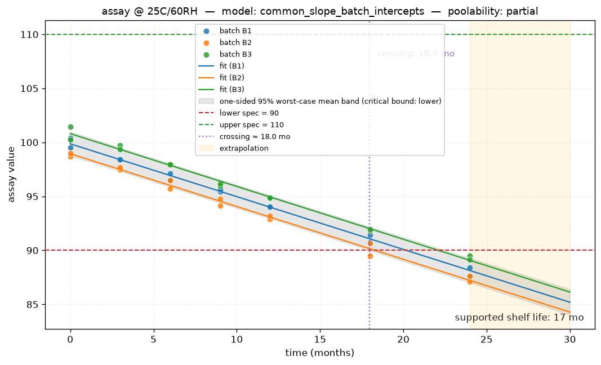
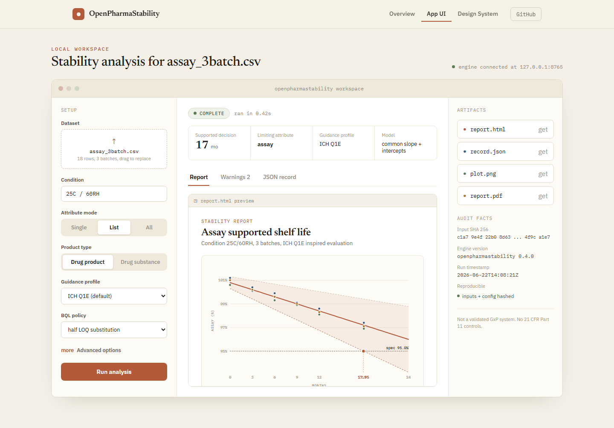

# OpenPharmaStability

ICH Q1E-inspired stability analysis and shelf-life reporting toolkit for
pharmaceutical development. **v1.0.4** is the current release. The v0.1
baseline (one attribute, one long-term condition, fixed-effect ANCOVA,
one-sided 95% bound, lower-spec crossing) has grown into a Python-first
analysis/reporting engine with multi-attribute analysis, XLSX input,
data-quality auditing, real BQL policies, transform-candidate evidence,
ICH Q1A(R2) significant-change gating, opt-in advanced statistics,
GuidanceProfile audit support, a Python API, portable report artifacts,
and a local v1 web workspace. The UI is a thin client over the Python
engine; it does not reimplement shelf-life statistics in JavaScript.

- CSV or XLSX input (single or multi attribute, single long-term condition)
- N-batch fixed-effect ANCOVA poolability at alpha = 0.25
- Linear raw-scale regression (transform candidates available as evidence)
- One-sided 95% confidence bound on the mean response
- Lower- and upper-spec crossing, rounded-down supported shelf life
- ICH Q1A(R2) significant-change gating of room-temperature extrapolation
- Optional Arrhenius / MKT / reduced-design / random-effects opt-ins
- HTML report + machine-readable JSON decision record
- Confidence-bound plot with extrapolation shading
- Local v1 UI workspace via `openpharmastability-ui`

> **Decision-support / educational only.** This is not a regulatory-approval
> tool, not submission-ready, and not a validated GxP / 21 CFR Part 11 system.
> See `DISCLAIMER` in `openpharmastability/contracts.py`.

## Case study: the golden assay dataset

`examples/assay_3batch.csv` is the toolkit's frozen golden fixture — 3 batches,
7 time points, 42 rows of a decreasing assay attribute with a lower spec of 90.0:

```csv
batch,condition,time_months,attribute,value,lower_spec,upper_spec,direction
B1,25C/60RH,0.0,assay,100.3961,90.0,110.0,decreasing
B1,25C/60RH,0.0,assay,99.5295,90.0,110.0,decreasing
B1,25C/60RH,3.0,assay,98.3637,90.0,110.0,decreasing
...
```

Running the CLI against it:

```bash
openpharmastability analyze examples/assay_3batch.csv \
    --condition "25C/60RH" --attribute assay \
    --output build/report.html
```

produces the confidence-bound plot below (batch B2 governs the crossing) plus
an HTML report and a JSON decision record:



| Field | Value |
|---|---|
| Model selected | `common_slope_batch_intercepts` (partial poolability at alpha=0.25) |
| Confidence bound | one-sided 95% lower bound on the mean |
| Statistical crossing | 17.955 months |
| Supported shelf life | **17 months** (floor-rounded) |
| Governing batch | B2 |

The full artifacts for this exact run — the HTML report and the JSON decision
record — are checked in at
[`site-sample/sample-report.html`](site-sample/sample-report.html) and
[`site-sample/sample-report.json`](site-sample/sample-report.json), and are what
the [public site preview](#public-website-preview) links to.

### For CMC reviewers: how to read the output

The engine's job is to turn a raw stability table into a shelf-life decision a
reviewer can audit, not to make the call unsupervised. Reading the golden-dataset
report above end to end:

1. **Input** — `examples/assay_3batch.csv`. Each row is one measurement: batch,
   condition, time, attribute, value, and the spec limits/direction that define
   what "out of spec" means for this attribute.
2. **Poolability** — a two-step nested ANCOVA (`p_value_slopes_holm`,
   `p_value_intercepts_holm` in the JSON) decides whether batches share a common
   slope. Here slopes pool (p≈0.906) but intercepts don't (p≈3.3e-16, Holm-
   corrected), so the engine selects `common_slope_batch_intercepts`: one
   degradation rate, per-batch starting points.
3. **Bound and crossing** — a one-sided 95% lower confidence bound is computed
   on the mean response for every batch; `governing_batch` (`B2`) is whichever
   batch's bound crosses `lower_spec` earliest. That crossing time is
   `statistical_crossing_months`, and the reported shelf life is that value
   floored to whole months — never rounded up.
4. **Decision record** — `sample-report.json` is the machine-readable version of
   everything above: the model, the p-values, the crossing, the shelf life, plus
   `warnings` (e.g. the Cook's-distance flag on four rows in this dataset) and
   `model_convergence`. Anything in `warnings` is worth reading before signing
   off — the audit trail is deliberately verbose.
5. **Report** — `sample-report.html` is the same information rendered for a
   human reviewer, with the plot inlined and the disclaimer from
   `openpharmastability/contracts.py::DISCLAIMER` always present verbatim.

This is decision support, not a decision: every number here is reproducible
from the input CSV via `tools/regen_expected.py --check`, and the warnings
section of the report is where a reviewer's judgment comes in.

For a hiring-facing CMC framing (roles, resume bullets, interview pitch),
see [`CMC_ANALYTICS_POSITIONING.md`](CMC_ANALYTICS_POSITIONING.md).

### Local UI

The same analysis path is available in a local web workspace (thin client over the Python engine — no shelf-life math in JavaScript):

```bash
openpharmastability-ui --host 127.0.0.1 --port 8765
```

Open `http://127.0.0.1:8765` to upload CSV/XLSX, select condition and attributes, run the engine, and preview the HTML/JSON/plot artifacts.



### Multi-attribute limiting CQA

When several attributes share a long-term condition, the multi-attribute path evaluates each attribute independently and reports the **limiting CQA**: the attribute with the shortest supported shelf life (minimum across included attributes). Attributes that fail baseline or cannot claim a positive crossing do not drive a false “long” claim; the limiting decision uses the worst-case supported months among attributes included in the decision.

```bash
openpharmastability analyze examples/multi_attribute.csv \
    --condition "25C/60RH" --all-attributes \
    --metadata-csv examples/multi_attribute_metadata.csv \
    --output build/multi_report.html
```

On the bundled multi-attribute fixture this yields:

| Attribute | Supported shelf life | Role |
|---|---|---|
| assay | 16 months | included |
| impurity_a | **7 months** | **limiting** |
| **Product (min)** | **7 months** | limiting CQA = `impurity_a` |

Checked-in sample artifacts for this exact run (fixed `--source-epoch 1717200000`):

- [HTML report](site-sample/multi/multi-report.html)
- [JSON decision record](site-sample/multi/multi-report.json)
- [assay plot](site-sample/multi/plots/assay_confidence_plot.png) · [impurity_a plot](site-sample/multi/plots/impurity_a_confidence_plot.png)

These are decision-support samples only — not submission-ready and not a validated GxP system.


## Public website preview

`OpenPharmaStability.dc.html` is the authoring source for a static public
landing page. The deploy artifact lives in [`site/index.html`](site/index.html)
after running `node tools/sync-site.mjs`. The page presents the product story,
a mock local workspace, the design system, and links to real sample outputs
from the Python engine.

The `site-sample/` folder holds trackable artifacts generated by the
analysis pipeline (HTML report, JSON decision record, confidence plot). The
landing page links to these files directly, not to ignored `build/` outputs.

This preview is decision support and educational material only. It is not a
validated GxP system, does not provide 21 CFR Part 11 controls, and is not
intended for regulatory approval or submission.

### Local preview (authoring source)

Serve the repository root and open the DC component:

```bash
python -m http.server 8766
# http://127.0.0.1:8766/OpenPharmaStability.dc.html
```

### Local preview (deploy folder)

Build and serve the static deploy root (matches Cloudflare Pages output):

```bash
node tools/sync-site.mjs
python -m http.server 8766 --directory site
# http://127.0.0.1:8766/
npx -y -p playwright node tools/website-qa.mjs
```

Use `--dev` with the QA script when testing the authoring source instead:

```bash
python -m http.server 8766
npx -y -p playwright node tools/website-qa.mjs --dev
```

### Cloudflare Pages

**Live site:** https://openpharmastability.pages.dev

| Setting | Value |
|---------|-------|
| Project type | Direct Upload |
| Production branch | `main` |
| Output directory | `site` |
| Deployment workflow | `.github/workflows/pages-deployment.yml` |

After changing `OpenPharmaStability.dc.html`, `support.js`, or `site-sample/`,
run `node tools/sync-site.mjs` and commit the updated `site/` folder.

The existing Pages project is Direct Upload and cannot be converted to Git
integration. The GitHub workflow therefore deploys `site/` with Wrangler on
changes to `main`. It requires:

- repository variable `CLOUDFLARE_ACCOUNT_ID`, and
- repository secret `CLOUDFLARE_API_TOKEN` with **Account / Cloudflare Pages / Edit**
  permission limited to the owning account.

Create the scoped token in the Cloudflare dashboard, store it with
`gh secret set CLOUDFLARE_API_TOKEN`, then run
`gh workflow run pages-deployment.yml` once to verify the connection.

## Install

```bash
python -m venv .venv
. .venv/bin/activate          # Windows: .venv\Scripts\activate
pip install -e ".[dev]"
```

## CLI

```bash
openpharmastability analyze examples/assay_3batch.csv \
    --condition "25C/60RH" \
    --attribute assay \
    --output build/report.html
```

## v1.0.0 quick start

### Single-attribute (v0.1 back-compat)

```bash
openpharmastability analyze examples/assay_3batch.csv \
    --condition "25C/60RH" --attribute assay \
    --output build/report.html
```

Result: model=`common_slope_batch_intercepts`, statistical
crossing 17.95 mo, supported shelf life **17 mo**. The JSON record
also carries a `model_convergence` block (always populated; the
OLS / fixed-effect path reports `converged=True, boundary=False`)
and the v0.7.0 `lower_spec` / `upper_spec` fields (the spec
limits the engine used).

### Direct XLSX (v0.7.0)

The single-attribute `engine.analyze()` now accepts `.xlsx` and
`.xlsm` directly via the `load_table` dispatcher in `data/io.py`:

```bash
openpharmastability analyze examples/assay_3batch.xlsx \
    --condition "25C/60RH" --attribute assay \
    --output build/xlsx_report.html
```

### Multi-attribute (v0.2+)

```bash
openpharmastability analyze examples/multi_attribute.csv \
    --condition "25C/60RH" --all-attributes \
    --metadata-csv examples/multi_attribute_metadata.csv \
    --output build/multi_report.html
```

Result: 2 attributes, limiting **impurity_a** at 7 mo, per-attribute
plots written to `build/plots/`. The v0.7.0 release honors the
multi-attribute metadata `lower_spec` / `upper_spec` override
end-to-end: the override is applied to the per-attribute analysis
(v0.2.1 CHANGELOG claim, finally true in v0.7.0).

### XLSX with same-workbook metadata (v0.2.1+)

Build an XLSX with `results` and `attributes` sheets, then:

```bash
openpharmastability analyze stability.xlsx \
    --condition "25C/60RH" --all-attributes \
    --metadata-sheet attributes \
    --output build/xlsx_report.html
```

### Real BQL policies (v0.3.0)

```bash
openpharmastability analyze examples/bql_attribute.csv \
    --condition "25C/60RH" --attribute assay \
    --bql-policy manual_review \
    --output build/bql_report.html
```

Choices: `exclude` (default) | `flag` | `substitute_loq` |
`substitute_half_loq` | `manual_review`. The first two operate
on rows directly. The `substitute_*` policies require a finite
`loq` column and preserve the pre-substitution value in
`original_value`. `manual_review` keeps rows and flags the
attribute for human review in the report.

### Transform-candidate evidence (v0.3.0, opt-in)

```bash
openpharmastability analyze examples/assay_3batch.csv \
    --condition "25C/60RH" --attribute assay \
    --assess-transforms \
    --output build/transforms_report.html
```

The official shelf-life decision is unchanged. The report
adds a "Transform Candidate Evidence" section listing AICc,
s_resid, normality p, and homoscedasticity p for `none`,
`log`, and `sqrt` candidates. The recommendation is the valid
candidate with the lowest AICc; `recommendation_is_official`
is always False.

### ICH Q1A significant-change gating (v0.4.0)

```bash
openpharmastability analyze examples/assay_long_term.csv \
    --condition "25C/60RH" --attribute assay \
    --accelerated-condition "40C/75RH" \
    --intermediate-condition "30C/65RH" \
    --output build/q1a_report.html
```

When the dataset contains accelerated (40C/75RH) and/or
intermediate (30C/65RH) rows, the engine evaluates the five-criterion
ICH Q1A(R2) significant-change checklist (assay 5%, degradant OOS,
physical, pH, dissolution) per condition and applies the Q1E
extrapolation decision tree: no accelerated change → extrapolation
permitted within Q1E caps; change at < 3 mo → no extrapolation;
3-6 mo change → intermediate data required; intermediate change →
no extrapolation; change at > 6 mo → extrapolation permitted.

Opt out with `--no-significant-change-gate` to restore the v0.3.x
cap-only behavior byte-for-byte.

### Advanced statistics (v0.5.0, all opt-in)

```bash
# Arrhenius fit from multi-temperature rate data
openpharmastability analyze multi_temp.csv \
    --condition "25C/60RH" --attribute assay \
    --arrhenius --arrhenius-storage-temp 25.0

# Mean kinetic temperature from a `temp_c` column
openpharmastability analyze stability.csv \
    --condition "25C/60RH" --attribute assay \
    --mkt --mkt-ea-kj-mol 83.144

# ICH Q1D bracketing / matrixing detection
openpharmastability analyze stability.csv \
    --condition "25C/60RH" --attribute assay \
    --detect-reduced-design

# Random-effects mixed model (NOT the Q1E default)
openpharmastability analyze stability.csv \
    --condition "25C/60RH" --attribute assay \
    --random-effects
```

All four flags are opt-in. The default analyze() path is unchanged
from v0.4.0: fixed-effect ANCOVA, one-sided 95% bound on the mean,
Q1A-gated extrapolation. The opt-ins add `arrhenius_result`,
`mkt_celsius`, `reduced_design_report`, and `model_effects` fields
to the result; the v0.5.1 hotfix also surfaces
`model_convergence` at the top level for the mixed-model path.

### Export + artifact + acceptance-criteria (v0.6.0 + v0.7.0)

```bash
# v0.6.0: PDF copy (requires `pip install openpharmastability[pdf]`
# OR `.[pdf-fallback]`)
openpharmastability analyze stability.csv \
    --condition "25C/60RH" --attribute assay \
    --output build/report.html --pdf build/report.pdf

# v0.6.0: self-contained report bundle (HTML with the plot inlined
# as a base64 data URL, JSON, plots, optional PDF) with SHA-256
# digests and byte sizes.
openpharmastability analyze stability.csv \
    --condition "25C/60RH" --attribute assay \
    --output build/report.html --artifact-dir build/bundle

# v0.7.0: leave-one-out sensitivity over Cook's-distance outliers
openpharmastability analyze stability.csv \
    --condition "25C/60RH" --attribute assay \
    --sensitivity --output build/report.html

# v0.7.0: flat acceptance-criteria CSV for LIMS / regulatory
# tracking ingestion.
openpharmastability analyze stability.csv \
    --condition "25C/60RH" --attribute assay \
    --acceptance-csv build/acceptance.csv

# v0.8.0: leave-one-batch-out sensitivity (answers "is any single
# batch driving the shelf life?")
openpharmastability analyze stability.csv \
    --condition "25C/60RH" --attribute assay \
    --sensitivity --sensitivity-mode batch \
    --output build/report.html

# v0.8.0: Arrhenius-driven shelf-life prediction (model-based
# estimate from multi-temperature rate data; exploratory).
openpharmastability analyze multi_temp.csv \
    --condition "25C/60RH" --attribute assay \
    --arrhenius-shelf-life \
    --arrhenius-shelf-life-storage-temp 25.0 \
    --output build/report.html

# v0.9.0: per-batch Arrhenius rate diagnostic (flags outlier
# batches via robust z-score; per-batch kinetics).
openpharmastability analyze multi_temp.csv \
    --condition "25C/60RH" --attribute assay \
    --arrhenius --arrhenius-per-batch \
    --output build/report.html
```

### Python API (v0.6.0, programmatic surface)

```python
from openpharmastability import analyze_csv, analyze_multi, make_artifact
result = analyze_csv("examples/assay_3batch.csv",
                    condition="25C/60RH", attribute="assay")
print(result.supported_shelf_life_months)   # 17

multi = analyze_multi("examples/multi_attribute.csv",
                      condition="25C/60RH", all_attributes=True,
                      metadata_path="examples/multi_attribute_metadata.csv")
print(multi.limiting_attribute, multi.supported_shelf_life_months)
# impurity_a 7

artifact = make_artifact(result, "build/bundle")
print(artifact.html_sha256)   # byte-portable HTML
```

### Local v1 UI workspace

```bash
openpharmastability-ui --host 127.0.0.1 --port 8765
```

Then open `http://127.0.0.1:8765`. The workspace uploads CSV/XLSX
data, selects condition and one/many attributes, chooses product type
and guidance profile, exposes advanced opt-ins, and renders the
Python-generated HTML/JSON/plot artifacts. The same UI-facing surface
is available programmatically:

```python
from openpharmastability import UIAnalysisOptions, analyze_for_ui

manifest = analyze_for_ui(
    "examples/assay_3batch.csv",
    "build/ui_bundle",
    UIAnalysisOptions(condition="25C/60RH", attribute="assay"),
)
print(manifest.summary["supported_shelf_life_months"])
```

### Reproducible reports (v0.1.1+)

```bash
openpharmastability analyze ... --source-epoch 1700000000
```

Or set `SOURCE_DATE_EPOCH=1700000000` in the environment. Two
CLI runs with the same `--source-epoch` produce byte-identical
JSON.

### Data quality audit (v0.3.0)

The audit runs automatically on the raw input frame. The
report's "Data Quality" section lists issues by severity
(INFO / WARNING / ERROR). The audit reports issues but does not
block analysis.

```bash
openpharmastability analyze examples/data_quality_messy.csv \
    --condition "25C/60RH" --attribute assay \
    --output build/quality_report.html
```

Expect warnings for inconsistent `lower_spec` and `direction`,
and an INFO entry for a row whose `condition` doesn't match the
requested one. The engine still runs (the audit reports, it does
not gate).

## What v1.0.0 adds over v0.11.0

| Area | v0.11.0 | v1.0.0 |
|---|---|---|
| UI | No UI; backend/API/report artifacts only. | Local web workspace served by `openpharmastability-ui`; upload data, configure analysis, run the Python engine, preview/download artifacts. |
| UI service | Downstream callers consumed engine/API objects directly. | `ui_service.analyze_for_ui()` returns a stable manifest: summary, warnings, guidance profile, artifact paths/URLs, sizes, and hashes. |
| Packaging | CLI script only. | Adds `openpharmastability-ui` and packaged static UI assets. |
| Analysis behavior | Guidance profile selectable; default path unchanged. | Statistics remain Python-owned; UI consumes generated HTML/JSON/plots and does not duplicate math. |

## What v0.9.0 added over v0.8.0

| Area | v0.8.0 | v0.9.0 (more backend features) |
|---|---|---|
| Poolability p-values | Raw p-values only; no family-wise correction. | New `PoolabilityResult.p_slopes_holm` / `p_intercepts_holm` carry the Holm-Bonferroni corrected p-values for the two-step poolability test; preserves FWER at `alpha` while gaining power over the conservative Bonferroni correction. The raw `p_slopes` / `p_intercepts` are unchanged. |
| Multi-engine input | Multi path accepted `.xlsx` via a separate `data/xlsx` branch; single path used the v0.7.0 `load_table` dispatcher. | Multi `analyze_many` now uses the v0.7.0 `load_table` dispatcher - symmetry fix; `.csv`, `.xlsx`, `.xlsm` accepted on both paths via the same code path. |
| Per-batch Arrhenius | The pooled per-temperature rate is the only Arrhenius signal; batch-level kinetics aren't surfaced. | New `--arrhenius-per-batch` flag; engine builds a per-(batch × temperature) rate dict and flags outlier batches via robust z-score (default 2.5). `ArrheniusResult.per_batch_rate_by_temp` and `ArrheniusResult.outlier_batches` are additive fields. |
| Multi-attribute metadata surfacing | `unit` and `report_order` were on `AttributeMetadata` but not surfaced in the per-attribute HTML block or overview table. | Per-attribute HTML block now shows `unit` and `report_order`; overview table has a `Unit` column; a new top-level `attribute_order` key in the multi JSON record sorts eligible attributes by `report_order`. |
| Documentation | - | README / HANDOVER / NEXT_STEPS / CHANGELOG all synced to v0.9.0. |
| Tests | 437 at v0.8.0. | 437 -> **451** at v0.9.0; new tests for Holm correction, multi XLSX dispatch, per-batch Arrhenius outlier detection, and unit / report_order surfacing. |
The v0.8.0 shelf-life math is **unchanged** (linear, raw-scale, fixed-effect
batch, alpha = 0.25, one-sided 95% t-quantile, floor rounding, worst-case
earliest crossing, Q1A significant-change gating, PDF + artifact
export, pure-numpy regen, Arrhenius-driven shelf-life, batch-out
sensitivity). v0.9.0 layers opt-in Holm correction + multi XLSX
dispatch + per-batch Arrhenius + unit / report_order surfacing on
top; the default path produces the same numbers as v0.8.0.

See `CHANGELOG.md` for the full per-release entries. Future work and
known limitations are tracked in `NEXT_STEPS.md`.

## Tests

```bash
pytest -q
```

The full suite is expected to collect **483 tests** after v1.0.0
(plus PDF-backend tests that skip cleanly on hosts without weasyprint/pdfkit).
Use the project venv on Windows:

```powershell
.\.venv\Scripts\python.exe -m pytest --collect-only -q
.\.venv\Scripts\python.exe -m pytest -q > build\pytest.out 2>&1
```

Earlier v0.9.0 documentation reported **451 passing** (plus 4 PDF-backend tests that
skip cleanly on hosts without weasyprint/pdfkit). The golden-file
test in `validation/test_golden.py` locks slope, intercept,
residual SE, one-sided 95% bound, statistical crossing, and rounded
shelf life against the frozen expected values in
`examples/assay_3batch.expected.json`. `validation/conftest.py`
fails collection (exit code 2) if any v0.5 module is missing —
the v0.5 tests are hard-required, not skip-if-missing.

The independent validator `tools/regen_expected.py --check` is
also part of CI: it recomputes the golden values from scratch
using a pure-numpy path and exits 0 if the engine still agrees.
v0.7.0 made the regen fully independent of the engine (no shared
statsmodels backend).

## Layout

```
openpharmastability/
  contracts.py         # frozen shared dataclasses / enums / constants
  data/                # CSV/XLSX I/O, schema, condition parser, BQL/replicate/quality
                       #   load_table (v0.7.0) auto-dispatches by extension
  stats/               # regression, poolability, bounds, diagnostics,
                       #   transforms (v0.3), arrhenius (v0.5), mkt (v0.5),
                       #   sensitivity (v0.7.0)
  models/              # model selection
  shelf_life/          # engine + extrapolation caps + multi-attribute engine
  regulatory/          # significant-change (v0.4), reduced-design (v0.5)
  reports/             # HTML + JSON decision record (single + multi)
                       #   + pdf (v0.6) + artifacts (v0.6)
  api.py               # v0.6.0 thin programmatic surface
  ui_service.py        # v1.0.0 UI-facing manifest wrapper
  ui_server.py         # v1.0.0 local web UI server
  ui/static/           # v1.0.0 packaged local UI assets
  plots/               # confidence-bound plot
  cli.py               # console entry point
examples/              # sample CSV/XLSX fixtures + expected.json
validation/            # pytest suites
```

## Limitations / out of scope (current and future)

v1.0.4 is the current release. The stats engine remains in Python
and ICH Q1E-style fixed-effect by default; the opt-in advanced
features (Arrhenius, MKT, reduced designs, random effects,
sensitivity, acceptance-criteria CSV) are clearly labelled
exploratory. The v1 UI is local and thin: the math and the JSON
decision record stay authoritative, and no GxP / 21 CFR Part 11
validation claim is made.

Out of scope for the current release: hosted/cloud UI, production REST API,
multi-condition shelf-life selection (the engine reports per
long-term condition, not the limiting one), and any GxP / 21 CFR
Part 11 validation claim.

## Development

The repo ships with a small cross-platform build tool — a GNU
`Makefile` at the repo root. It is the canonical entry point for
contributors on Linux / macOS / WSL / git-bash on Windows and
wraps the four operations the project does most often: clear
stale `__pycache__` directories, byte-compile sources, reinstall
the package, and run the test suite.

### Targets

```text
make help         # show the help text + variable defaults
make fresh        # clean + recompile + install + test (canonical reset)
make clean        # remove __pycache__/, .pyc, .pytest_cache outside .venv
make recompile    # byte-compile all sources with -f
make install      # pip install -e .[dev]
make test         # run pytest -q
make regen-check  # run tools/regen_expected.py --check
```

The `make fresh` target is the canonical "I don't trust my
environment" command: it deletes every `__pycache__/` and stray
`.pyc` / `.pyo` outside `.venv`, removes `.pytest_cache`, force
recompiles `openpharmastability/`, `tools/`, and `validation/`,
reinstalls the package in editable mode with the `[dev]` extra,
and then runs the full pytest suite. Run it after a fresh
checkout, after pulling across machines, or any time a test
fails in a way that looks like a stale `.pyc` masking the real
source.

All variables use `?=`, so they can be overridden on the command
line, e.g. `make test PYTEST_OPTS='-k test_engine'` (when
pytest is invoked with extra args) or `make test PYTHON=python3.11`.

### Windows native PowerShell: the pycache integrity script

The Makefile is POSIX (`find` / `xargs` / `rm -rf`) and works
under git-bash, WSL, and native Linux / macOS. On a stock
Windows host without git-bash, the same operations are still
available as a PowerShell block in `NEXT_STEPS.md` §7.1 — that
is the Windows-native complement to the Makefile. Both delete
every `__pycache__/` directory and stray `.pyc` / `.pyo` file
outside `.venv` and clear `.pytest_cache`; the PowerShell
version uses `Get-ChildItem ... | Remove-Item -Recurse -Force`,
the Makefile version uses `find ... -print0 | xargs -0 rm -rf`.
The two are equivalent; pick whichever shell you are already in.

### Tip: run Python without writing bytecode

For day-to-day development, you can sidestep the entire class
of stale-`__pycache__` problems by telling Python not to write
`.pyc` files in the first place. Either set the env var

```bash
export PYTHONDONTWRITEBYTECODE=1
```

or pass `-B` on the command line:

```bash
python -B -m pytest -q
python -B tools/regen_expected.py --check
```

This is the same flag used by the project's pre-commit hook
(see `NEXT_STEPS.md` §7.4) and is a strict superset of the
`make clean` target — it never writes the cache, so there is
nothing to clean.

### A note on the v0.5.1 conftest hard-require philosophy

`validation/conftest.py` is intentionally unforgiving: at
pytest collection time it imports each v0.5+ module
(`stats.arrhenius`, `stats.mkt`,
`regulatory.reduced_design`, `regulatory.significant_change`)
and, if any is missing, calls `pytest.exit(..., returncode=2)`.
The whole test run then aborts before a single test function
executes — there is no skip-if-missing fallback. This is
deliberate: a "skipped" report looks healthy, hides a real
regression, and is exactly the kind of green-bar lie the
hard-require guard exists to prevent. Contributors adding a
new v0.5+ module must register it in
`validation/conftest.py::_REQUIRED_V050_MODULES` in the same
commit that adds the module, or collection will fail.

## Reproducibility metadata

Every report embeds the input file SHA-256, row/column counts, library
versions, tool version, ISO-8601 timestamp, and (if applicable) the random
seed used. Two CLI runs with the same `--source-epoch` (or the same
`SOURCE_DATE_EPOCH` env var) produce byte-identical JSON — see
"Reproducible reports" above for the full command.
